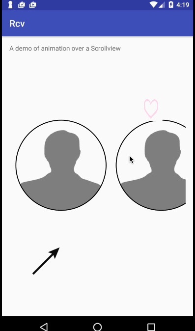

# Animation Example

This project shows an example of a Property animation and an animation drawable. It also shows how to handle onPause()
correctly.

Here is the simple animation .

commit 1
commit 2

